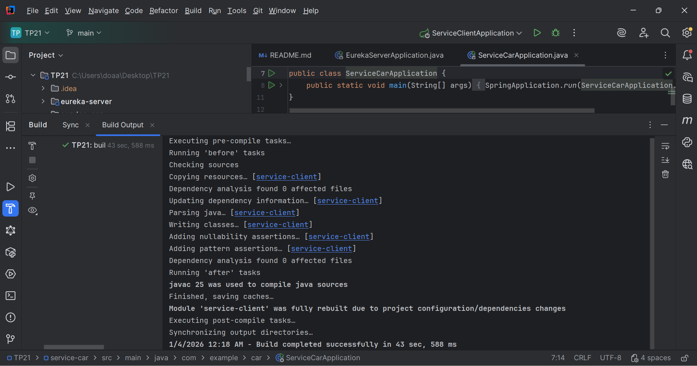

# TP21 - Microservices avec Eureka Server

Ce projet contient trois microservices Spring Boot configurés avec Eureka Server pour la découverte de services.

## Structure du projet

- **eureka-server** : Serveur de découverte Eureka (port 8761)
- **service-client** : Microservice de gestion des clients (port 8081)
- **service-car** : Microservice de gestion des voitures (port 8082)

This screenshot shows the successful build of the **service-client** module in IntelliJ (Java 25), confirming that the project compiles correctly and dependencies are properly configured.



## Prérequis

- Java 17+
- Maven
- MySQL local (port 3306) avec utilisateur `root` (sans mot de passe par défaut)
- Postman ou curl pour tester les endpoints

## Installation et démarrage

### 1. Vérifier MySQL

Assurez-vous que MySQL est démarré et accessible sur le port 3306.

### 2. Démarrer Eureka Server

```bash
cd eureka-server
mvn spring-boot:run
```

Le dashboard Eureka sera accessible sur : http://localhost:8761

### 3. Démarrer service-client

```bash
cd service-client
mvn spring-boot:run
```

Le service sera accessible sur : http://localhost:8081

### 4. Démarrer service-car

```bash
cd service-car
mvn spring-boot:run
```

Le service sera accessible sur : http://localhost:8082

## Tests

### 1. Vérifier l'enregistrement dans Eureka

Ouvrir http://localhost:8761 et vérifier que `SERVICE-CLIENT` et `SERVICE-CAR` apparaissent dans "Instances currently registered".

### 2. Créer un client

```bash
POST http://localhost:8081/api/clients
Content-Type: application/json

{
  "nom": "Salma",
  "age": 22
}
```

### 3. Récupérer tous les clients

```bash
GET http://localhost:8081/api/clients
```

Noter l'ID du client créé (ex: 1)

### 4. Tester l'appel inter-service

```bash
GET http://localhost:8082/api/test/client/1
```

Cela teste l'appel de `service-car` vers `service-client` via Eureka.

### 5. Créer une voiture

```bash
POST http://localhost:8082/api/cars
Content-Type: application/json

{
  "marque": "Toyota",
  "modele": "Yaris",
  "clientId": 1
}
```

### 6. Récupérer les voitures avec enrichissement client

```bash
GET http://localhost:8082/api/cars
```

Le résultat devrait inclure les informations du client pour chaque voiture.

## Configuration

### Bases de données

- **service-client** : `clientservicedb` (créée automatiquement)
- **service-car** : `carservicedb` (créée automatiquement)

### Modification du mot de passe MySQL

Si votre MySQL a un mot de passe, modifiez les fichiers `application.yml` dans chaque service :

```yaml
spring:
  datasource:
    password: votre_mot_de_passe
```

## Dépannage

### No instances available for SERVICE-CLIENT

- Vérifier que `@LoadBalanced` est présent sur `WebClient.Builder`
- Vérifier que la dépendance `spring-cloud-starter-loadbalancer` est présente
- Vérifier que `service-client` est bien enregistré dans Eureka

### Erreur MySQL

- Vérifier que MySQL est démarré
- Vérifier le username/password dans `application.yml`
- Vérifier les droits de création de base de données

### 404 sur endpoints

- Vérifier le port utilisé (8081 pour client, 8082 pour car)
- Vérifier le chemin exact dans `@RequestMapping`

